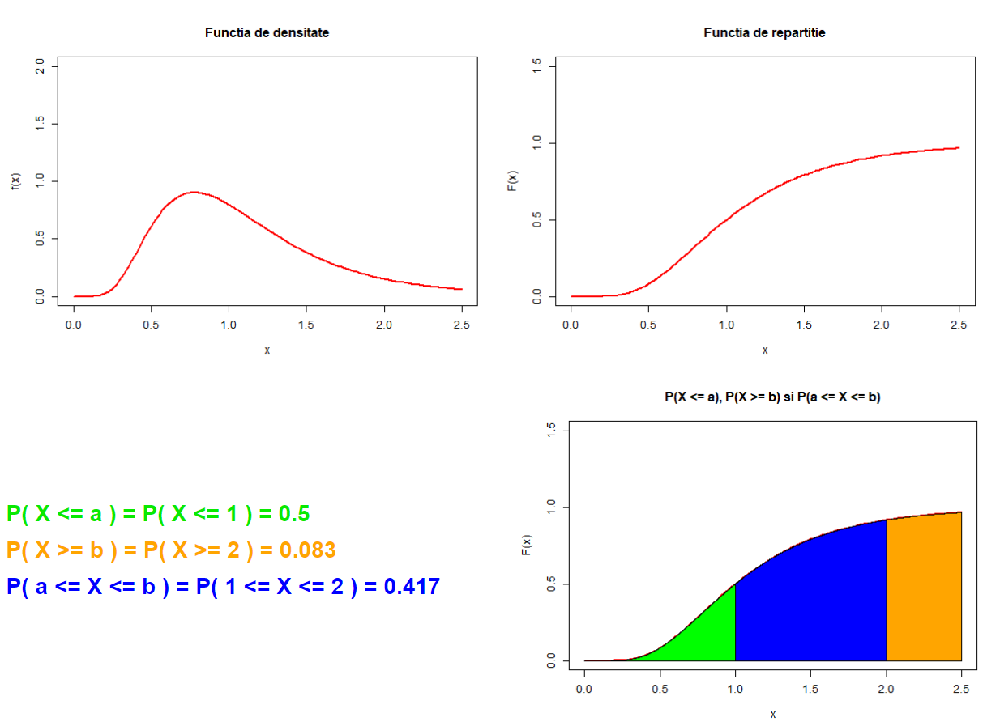
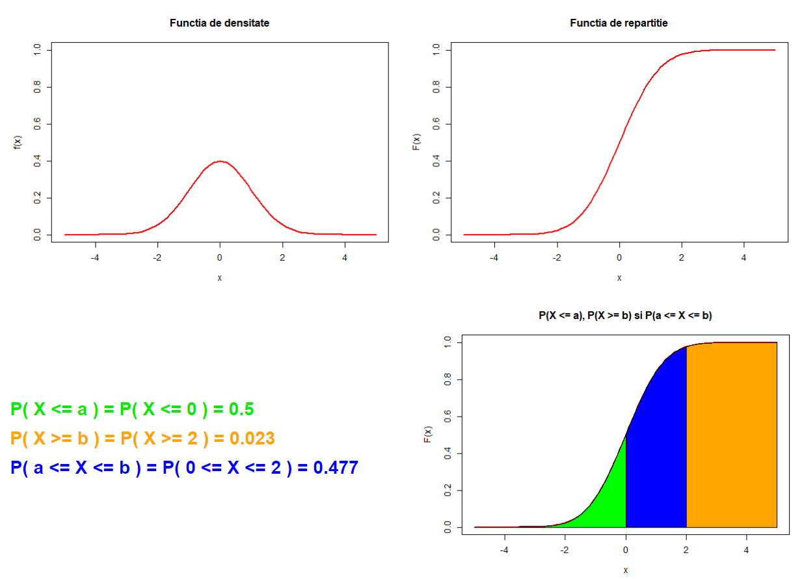

```{r setup, include=FALSE}
knitr::opts_chunk$set(echo = TRUE)
```

## Introducere

Aplicația creată ilustrează 15 repartiții atât discrete, cât și continue și modul în care pot fi utilizate în calcul. Astfel pentru fiecare repartiție se pot selecta valorile parametrilor care definesc repartiția, ilustrând grafic densitatea (respectiv funcția de masă) și funcția de repartiție. Se pot calcula probabilități de tipul P(X $\leq$ a), P(X $\geq$ b) sau P(a $\leq$ X $\leq$ b), pentru valori ale lui a și b date și se poate ilustra grafic probabilitatea calculată prin colorarea zonei corespunzătoare.

## Crearea aplicației

Am creat layout-ul aplicației și un panel care conține o serie de opțiuni de repartiții și două \textbf{numericInput}-uri pentru alegerea parametrilor comuni a și b. Pentru a selecta o repartiție am folosit \textbf{radioButtons}, iar mai apoi am reprezentat grafic în funcție de repartiția aleasă. Pentru fiecare repartiție am utilizat câte un \textbf{box} care conține unul sau mai multe \textbf{numericInput}-uri pentru a introduce valorile parametrilor repartiției alese. Graficele funcțiilor, valorile probabilităților și graficul colorat sunt afișate în pagină prin intermediul a două \textbf{plotOutput}-uri și a trei \textbf{textOutput}-uri, acestea fiind aranjate cu ajutorul unui \textbf{fluidRow} pe două coloane.

```{r message=FALSE, warning=FALSE}
library(shiny)
library(gridExtra)
library(shinyjs)
library(shinydashboard)
library(crayon)

ui <- fluidPage(
  titlePanel("Repartitii discrete si continue"),
  
  sidebarLayout(
    sidebarPanel(
      useShinyjs(),
      radioButtons("var",  h3("Repartitia"),
                   choices = list("Beta" = 1, 
                                  "Binomiala" = 2,
                                  "Cauchy" = 3,
                                  "Chy-Squared" = 4, 
                                  "Exponentiala" = 5,
                                  "Fisher" = 6,
                                  "Gamma" = 7, 
                                  "Hipergeometrica" = 8,
                                  "Log-Normala" = 9,
                                  "Logistica" = 10, 
                                  "Normala" = 11,
                                  "Poisson" = 12,
                                  "Student" = 13, 
                                  "Uniforma" = 14,
                                  "Weibull" = 15),
                   selected = 1),
      helpText(h3("Parametrii a si b")),
      numericInput( "a", 
                    h4("a"), 
                    value = 0),
      numericInput( "b", 
                    h4("b"), 
                    value = 0)
      
    ),
    
    mainPanel(
      box(id= "uniforma",  width = '800px',
        numericInput( "minU", 
                   h3("Minim"), 
                   value = 0),
        numericInput( "maxU", 
                      h3("Maxim"), 
                      value = 1)
      ),
      box(id= "binomiala",  width = '800px',
          numericInput( "n", 
                        h3("n"), 
                        value = 1),
          numericInput( "p", 
                        h3("p"), 
                        value = 0,
                        min = 0,
                        max = 1,
                        step = 0.1)
      ),
      box(id= "cauchy",  width = '800px',
          numericInput( "t", 
                        h3("t"), 
                        value = 0),
          numericInput( "s", 
                        h3("s"), 
                        value = 1,
                        min = 0)
      ),
      box(id= "Chy-Squared",  width = '800px',
          numericInput( "k", 
                        h3("k"), 
                        min = 1,
                        value = 1,
                        step = 1)
      ),
      box(id= "exponentiala",  width = '800px',
          numericInput( "lambda", 
                        h3("Lambda"), 
                        min = 0.1,
                        value = 1,
                        step = 0.1)
      ),
      box(id= "fisher",  width = '800px',
          numericInput( "d1", 
                        h3("d1"), 
                        min = 0.1,
                        value = 0.1,
                        step = 0.1),
          numericInput( "d2", 
                        h3("d2"), 
                        min = 0.1,
                        value = 0.1,
                        step = 0.1)
      ),
      box(id= "gamma",  width = '800px',
          numericInput( "alpha", 
                        h3("alpha"), 
                        min = 0.1,
                        value = 0.1,
                        step = 0.1),
          numericInput( "beta", 
                        h3("beta"), 
                        min = 0.1,
                        value = 0.1,
                        step = 0.1)
      ),
      box(id= "hipergeometrica",  width = '800px',
          numericInput( "m_", 
                        h3("Numarul de bile albe(m)"), 
                        min = 0,
                        value = 0,
                        step = 1),
          numericInput( "n_", 
                        h3("Numarul de bile negre(n)"), 
                        min = 0,
                        value = 0,
                        step = 1),
          numericInput( "k_", 
                        h3("Numarul de bile extrase(k)"), 
                        min = 0,
                        value = 0,
                        step = 1)
      ),
      box(id= "log-normala",  width = '800px',
          numericInput( "mu", 
                        h3("mu"), 
                        value = 0,
                        step = 0.1),
          numericInput( "teta", 
                        h3("teta"), 
                        min = 0,
                        value = 1,
                        step = 0.1)
      ),
      box(id= "logistica",  width = '800px',
          numericInput( "tt", 
                        h3("t"), 
                        value = 0),
          numericInput( "ss", 
                        h3("s"), 
                        value = 1,
                        min = 0)
      ),
      box(id= "normala",  width = '800px',
          numericInput( "mu_", 
                        h3("mu"), 
                        value = 0,
                        step = 0.1),
          numericInput( "teta_", 
                        h3("teta^2"), 
                        min = 0,
                        value = 1,
                        step = 0.1)
      ),
      box(id= "poisson",  width = '800px',
          numericInput( "lambda_", 
                        h3("lambda"), 
                        min = 0.1,
                        value = 0.1,
                        step = 0.1)
      ),
      box(id= "student",  width = '800px',
          numericInput( "d", 
                        h3("d"), 
                        min = 0,
                        value = 1,
                        step = 1)
      ),
      box(id= "Beta",  width = '800px',
          numericInput( "alpha_", 
                        h3("alpha"), 
                        min = 0.1,
                        value = 0.1,
                        step = 0.1),
          numericInput( "beta_", 
                        h3("beta"), 
                        min = 0.1,
                        value = 0.1,
                        step = 0.1)
      ),
      box(id= "weibull",  width = '800px',
          numericInput( "kk", 
                        h3("k"), 
                        min = 0.1,
                        value = 1,
                        step = 0.1)
      ),
      
      plotOutput("functii"),
      fluidRow(
        column(6,
            div(style = "height:20px; font-size:25px; color: rgb(9, 233, 1); 
                margin-bottom: 20px; margin-top: 140px; font-weight: bold;", 
                textOutput("Px_a_val")),
            div(style = "height:20px; font-size:25px; color: orange; margin-bottom: 20px; 
                font-weight: bold;", textOutput("Px_b_val")),
            div(style = "height:20px; font-size:25px; color: blue; font-weight: bold;", 
                textOutput("Px_a_b_val"))
        ),
        column(6,
          plotOutput("Px_a")
        )
      )
    )
  )
)

```

In funcție de opțiunea aleasă, am lăsat afișate numai input-urile specifice repartiției selectate. Apoi, am trasat graficele funcției de masă/densității și funcției de repartiției. În continuare, am calculat probabilitățile de tipul P(X $\leq$ a), P(X $\geq$ b) sau P(a $\leq$ X $\leq$ b), pentru valorile lui a și b date și am ilustrat grafic probabilitățile calculate prin colorarea zonelor corespunzătoare.

```{r}
server <- function(input, output) {
  
  observeEvent(input$var, {
    # if pentru fiecare repartitie
  })
}

```

La final, pentru a afișa interfața și a porni server-ul am rulat următoarea comandă:
```{r eval = FALSE}
shinyApp(ui = ui, server = server)
```
\vspace{2cm}

## Repartițiile abordate

### 1. Repartiția Beta

```{r eval = FALSE}
if(input$var == 1)
    { shinyjs::hide(id = "uniforma")
      shinyjs::hide(id = "binomiala")
      shinyjs::hide(id = "cauchy")
      shinyjs::hide(id = "Chy-Squared")
      shinyjs::hide(id = "exponentiala")
      shinyjs::hide(id = "fisher")
      shinyjs::hide(id = "gamma")
      shinyjs::hide(id = "hipergeometrica")
      shinyjs::hide(id = "log-normala")
      shinyjs::hide(id = "logistica")
      shinyjs::hide(id = "poisson")
      shinyjs::hide(id = "student")
      shinyjs::hide(id = "normala")
      shinyjs::show(id = "Beta")
      shinyjs::hide(id = "weibull")
      output$functii <- renderPlot({par(mfrow = c(1, 2))
        curve(dbeta(x, shape1 = input$alpha_, shape2 = input$beta_), 0, 1, 
              ylim = c(0, 2.5), ylab = "f(x)",col = "red", lwd = 2, 
              main = "Functia de densitate")
        curve(pbeta(x, shape1 = input$alpha_, shape2 = input$beta_),0 ,1, 
              ylim = c(0, 1), type = "l", main = "Functia de repartitie",
              ylab = "F(x)", lwd = 2, col = "red")})
      
      output$Px_a_val <- renderText({ 
        paste("P( X <= a ) = P( X <=", input$a, ") =", 
              round(pbeta(input$a, shape1 = input$alpha_, shape2 = input$beta_), 
              digits = 3))
        
      })
      output$Px_b_val <- renderText({ 
        paste("P( X >= b ) = P( X >=", input$b, ") =", 
              1 - round(pbeta(input$b, shape1 = input$alpha_, shape2 = input$beta_), 
              digits = 3))
        
      })
      output$Px_a_b_val <- renderText({ 
        paste("P( a <= X <= b ) = P(",input$a,"<= X <=", input$b, ") =", 
              round((pbeta(input$b, shape1 = input$alpha_, shape2 = input$beta_) - 
              pbeta(input$a, shape1 = input$alpha_, shape2 = input$beta_)), digits = 3))
      })
      
      output$Px_a <- renderPlot({curve(pbeta(x, shape1=input$alpha_, shape2=input$beta_),
              0, 1, ylim = c(0, 1), type = "l", 
              main = "P(X <= a), P(X >= b) si P(a <= X <= b)",
              ylab = "F(x)", lwd = 2, col = "red")
        
        x <- seq(0,input$a, by=0.01)
        x1 <- c(x, seq(input$a,0, by=-0.01))
        y <- c(c(pbeta(x, shape1 = input$alpha_, shape2 = input$beta_)),
               seq(0,0, length = length(x)))
        polygon(x1, y, col = "green")
        
        x <- seq(input$b, 1, by=0.01)
        x1 <- c(x, seq(1, input$b, by=-0.01)) 
        y <- c(c(pbeta(x,shape1 = input$alpha_, shape2 = input$beta_)),
               seq(0,0, length = length(x)))
        polygon(x1, y, col = "orange")
        
        x<-seq(input$a, input$b, by=0.01)
        x1 <- c(x, seq(input$b, input$a, by=-0.01))
        y <- c(c(pbeta(x, shape1 = input$alpha_, shape2 = input$beta_)),
               seq(0,0, length = length(x)))
        polygon(x1, y, col = "blue")
      })
    }
```
\

#### Exemplu: \

Pentru alpha = 2, beta = 5, a = 0.3, b = 0.7:


### 2. Repartiția Binomială
```{r eval = FALSE}
if(input$var == 2)
    {shinyjs::hide(id = "uniforma")
    shinyjs::show(id = "binomiala")
    shinyjs::hide(id = "cauchy")
    shinyjs::hide(id = "Chy-Squared")
    shinyjs::hide(id = "exponentiala")
    shinyjs::hide(id = "fisher")
    shinyjs::hide(id = "gamma")
    shinyjs::hide(id = "log-normala")
    shinyjs::hide(id = "hipergeometrica")
    shinyjs::hide(id = "logistica")
    shinyjs::hide(id = "poisson")
    shinyjs::hide(id = "student")
    shinyjs::hide(id = "normala")
    shinyjs::hide(id = "Beta")
    shinyjs::hide(id = "weibull")
    output$functii <- renderPlot({par(mfrow = c(1, 2))
      plot(seq(0,40,1),dbinom(seq(0,40,1),size = input$n, prob = input$p),type="p", 
           xlab = "x", ylab = "F(x)", main = "Functia de masa",
           lwd = 2, col = "red")
      plot(seq(0,40,1),pbinom(seq(0,40,1), size = input$n, prob = input$p),type="p", 
           xlab = "x", ylab = "F(x)",
           main = "Functia de repartitie", lwd = 2, col = "red")})
    
      output$Px_a_val <- renderText({ 
        paste("P( X <= a ) = P( X <=", input$a, ") =", 
              round(pbinom(input$a, size = input$n, prob = input$p), digits = 3))
        
      })
      output$Px_b_val <- renderText({ 
        paste("P( X >= b ) = P( X >=", input$b, ") =", 
              1 - round(pbinom(input$b, size = input$n, prob = input$p), digits = 3))
        
      })
      output$Px_a_b_val <- renderText({ 
        paste("P( a <= X <= b ) = P(",input$a,"<= X <=", input$b, ") =", 
              round((pbinom(input$b, size = input$n, prob = input$p) - 
              pbinom(input$a, size = input$n, prob = input$p)), digits = 3))
        
      })
      output$Px_a <-renderPlot({plot(seq(0,40,1),pbinom(seq(0,40,1), 
              size = input$n, prob = input$p),type="p", xlab = "x", ylab = "F(x)",
              main = "Functia de repartitie", lwd = 2, col = "red")
        x <- seq(0,input$a, by=0.2)
        x1 <- c(x, seq(input$a,0, by=-0.2))
        y <- c(c(pbinom(x, size = input$n, prob = input$p)),seq(0,0, length = length(x)))
        polygon(x1, y, col = "green")
        
        x <- seq(input$b, input$n, by=0.2)
        x1 <- c(x, seq(input$n, input$b, by=-0.2) ) 
        y <- c(c(pbinom(x, size = input$n, prob = input$p)),seq(0,0, length = length(x)))
        polygon(x1, y, col = "orange")
        
        x<-seq(input$a, input$b, by=0.2)
        x1 <- c(x, seq(input$b, input$a, by=-0.2))
        y <- c(c(pbinom(x, size = input$n, prob = input$p)),seq(0,0, length = length(x)))
        polygon(x1, y, col = "blue")
      })
  }
```
\

#### Exemplu: \

Pentru n = 20, p = 0.7, a = 12, b = 17:


\vspace{4cm}

### 3. Repartiția Cauchy
```{r eval = FALSE}
if(input$var == 3)
    {shinyjs::hide(id = "uniforma")
      shinyjs::hide(id = "binomiala")
      shinyjs::show(id = "cauchy")
      shinyjs::hide(id = "Chy-Squared")
      shinyjs::hide(id = "exponentiala")
      shinyjs::hide(id = "fisher")
      shinyjs::hide(id = "gamma")
      shinyjs::hide(id = "log-normala")
      shinyjs::hide(id = "hipergeometrica")
      shinyjs::hide(id = "logistica")
      shinyjs::hide(id = "poisson")
      shinyjs::hide(id = "student")
      shinyjs::hide(id = "normala")
      shinyjs::hide(id = "Beta")
      shinyjs::hide(id = "weibull")
      output$functii <- renderPlot({par(mfrow = c(1, 2))
        curve(dcauchy(x, location  = input$t, scale = input$s), input$t-2, input$t+2, 
              ylim = c(0, dcauchy(input$t, location  = input$t, scale = input$s)+0.2),
              ylab = "f(x)",col = "red", lwd = 2, main = "Functia de densitate")
     curve(pcauchy(x, location  = input$t, scale = input$s),input$t-2, input$t+2, 
              ylim = c(0, 1), type = "l", main = "Functia de repartitie",
              ylab = "F(x)", lwd = 2, col = "red")})
      
      output$Px_a_val <- renderText({ 
        paste("P( X <= a ) = P( X <=", input$a, ") =", 
              round(pcauchy(input$a, location  = input$t, scale = input$s), digits = 3))
        
      })
      output$Px_b_val <- renderText({ 
        paste("P( X >= b ) = P( X >=", input$b, ") =", 
              1 - round(pcauchy(input$b, location  = input$t, scale = input$s), 
              digits = 3))
        
      })
      output$Px_a_b_val <- renderText({ 
        paste("P( a <= X <= b ) = P(",input$a,"<= X <=", input$b, ") =", 
              round((pcauchy(input$b, location  = input$t, scale = input$s) - 
              pcauchy(input$a, location  = input$t, scale = input$s)), digits = 3))
      })
      
      output$Px_a <- renderPlot({curve(pcauchy(x, location  = input$t, scale = input$s),
              input$t-2, input$t+2, ylim = c(0, 1), type = "l", 
              main = "P(X <= a), P(X >= b) si P(a <= X <= b)", ylab = "F(x)", lwd = 2, 
              col = "red")
      
      x <- seq(input$t-2,input$a, by=0.2)
      x1 <- c(x, seq(input$a,input$t-2, by=-0.2))
      y <- c(c(pcauchy(x, location  = input$t, scale = input$s)),
             seq(0,0, length = length(x)))
      polygon(x1, y, col = "green")
      
      x <- seq(input$b, input$t+2, by=0.2)
      x1 <- c(x, seq(input$t+2, input$b, by=-0.2)) 
      y <- c(c(pcauchy(x, location  = input$t, scale = input$s)),
             seq(0,0, length = length(x)))
      polygon(x1, y, col = "orange")
      
      x<-seq(input$a, input$b, by=0.2)
      x1 <- c(x, seq(input$b, input$a, by=-0.2))
      y <- c(c(pcauchy(x, location  = input$t, scale = input$s)),
             seq(0,0, length = length(x)))
      polygon(x1, y, col = "blue")
      })
  }
```
\

#### Exemplu: \

Pentru t = 0, s = 1, a = -1, b = 1:


\vspace{2cm}

### 4. Repartiția Chy-Squared
```{r eval = FALSE}
if(input$var == 4)
    {shinyjs::hide(id = "uniforma")
      shinyjs::hide(id = "binomiala")
      shinyjs::hide(id = "cauchy")
      shinyjs::show(id = "Chy-Squared")
      shinyjs::hide(id = "exponentiala")
      shinyjs::hide(id = "fisher")
      shinyjs::hide(id = "gamma")
      shinyjs::hide(id = "log-normala")
      shinyjs::hide(id = "hipergeometrica")
      shinyjs::hide(id = "logistica")
      shinyjs::hide(id = "poisson")
      shinyjs::hide(id = "student")
      shinyjs::hide(id = "normala")
      shinyjs::hide(id = "Beta")
      shinyjs::hide(id = "weibull")
      output$functii <- renderPlot({par(mfrow = c(1, 2))
        curve(dchisq(x, df  = input$k, ncp = 0), 0, input$k + 10, ylim = c(0, 0.6),
              ylab = "f(x)",col = "red", lwd = 2, main = "Functia de densitate")
      curve(pchisq(x, df  = input$k, ncp = 0),0, input$k + 10, ylim = c(0, 1), 
            type = "l", main = "Functia de repartitie", ylab = "F(x)", lwd = 2, 
            col = "red")})
      
      output$Px_a_val <- renderText({ 
        paste("P( X <= a ) = P( X <=", input$a, ") =", 
              round(pchisq(input$a, df  = input$k, ncp = 0), digits = 3))
        
      })
      output$Px_b_val <- renderText({ 
        paste("P( X >= b ) = P( X >=", input$b, ") =", 
              1 - round(pchisq(input$b, df  = input$k, ncp = 0), digits = 3))
        
      })
      output$Px_a_b_val <- renderText({ 
        paste("P( a <= X <= b ) = P(",input$a,"<= X <=", input$b, ") =", 
              round((pchisq(input$b, df  = input$k, ncp = 0) - 
              pchisq(input$a, df  = input$k, ncp = 0)), digits = 3))
      })
      
      output$Px_a <- renderPlot({curve(pchisq(x, df  = input$k, ncp = 0),
              0, input$k + 10, ylim = c(0, 1), type = "l", 
              main = "P(X <= a), P(X >= b) si P(a <= X <= b)",
              ylab = "F(x)", lwd = 2, col = "red")
        
        x <- seq(0,input$a, by=0.05)
        x1 <- c(x, seq(input$a,0, by=-0.05))
        y <- c(c(pchisq(x, df  = input$k, ncp = 0)),seq(0,0, length = length(x)))
        polygon(x1, y, col = "green")
        
        x <- seq(input$b, input$k+10, by=0.05)
        x1 <- c(x, seq(input$k+10, input$b, by=-0.05)) 
        y <- c(c(pchisq(x, df  = input$k, ncp = 0)),seq(0,0, length = length(x)))
        polygon(x1, y, col = "orange")
        
        x<-seq(input$a, input$b, by=0.05)
        x1 <- c(x, seq(input$b, input$a, by=-0.05))
        y <- c(c(pchisq(x, df  = input$k, ncp = 0)),seq(0,0, length = length(x)))
        polygon(x1, y, col = "blue")
      })
  }
```
\

#### Exemplu: \

Pentru k=4, a = 4, b = 10:
  

\vspace{3cm}

### 5. Repartiția Exponențială
```{r eval = FALSE}
if(input$var == 5)
    {shinyjs::hide(id = "uniforma")
      shinyjs::hide(id = "binomiala")
      shinyjs::hide(id = "cauchy")
      shinyjs::hide(id = "Chy-Squared")
      shinyjs::show(id = "exponentiala")
      shinyjs::hide(id = "fisher")
      shinyjs::hide(id = "gamma")
      shinyjs::hide(id = "log-normala")
      shinyjs::hide(id = "hipergeometrica")
      shinyjs::hide(id = "logistica")
      shinyjs::hide(id = "poisson")
      shinyjs::hide(id = "student")
      shinyjs::hide(id = "normala")
      shinyjs::hide(id = "Beta")
      shinyjs::hide(id = "weibull")
      output$functii <- renderPlot({par(mfrow = c(1, 2))
        curve(dexp(x, rate  = input$lambda), 0, 5, ylim = c(0, 1.5),
                 ylab = "f(x)",col = "red", lwd = 2, main = "Functia de densitate")
      curve(pexp(x, rate  = input$lambda),0, 5, ylim = c(0, 1), type = "l", 
            main = "Functia de repartitie", ylab = "F(x)", lwd = 2, col = "red")})
      
      output$Px_a_val <- renderText({ 
        paste("P( X <= a ) = P( X <=", input$a, ") =", 
              round(pexp(input$a, rate  = input$lambda), digits = 3))
        
      })
      output$Px_b_val <- renderText({ 
        paste("P( X >= b ) = P( X >=", input$b, ") =", 
              1 - round(pexp(input$b, rate  = input$lambda), digits = 3))
        
      })
      output$Px_a_b_val <- renderText({ 
        paste("P( a <= X <= b ) = P( ",input$a,"<= X <=", input$b, ") =", 
              round((pexp(input$b, rate  = input$lambda) - 
              pexp(input$a, rate  = input$lambda)), digits = 3))
      })
      
      output$Px_a <- renderPlot({curve(pexp(x, rate  = input$lambda),
              0, 5, ylim = c(0, 1), type = "l", 
              main = "P(X <= a), P(X >= b) si P(a <= X <= b)",
              ylab = "F(x)", lwd = 2, col = "red")
        
        x <- seq(0,input$a, by=0.05)
        x1 <- c(x, seq(input$a,0, by=-0.05))
        y <- c(c(pexp(x, rate  = input$lambda)),seq(0,0, length = length(x)))
        polygon(x1, y, col = "green")
        
        x <- seq(input$b, 5, by=0.05)
        x1 <- c(x, seq(5, input$b, by=-0.05)) 
        y <- c(c(pexp(x, rate  = input$lambda)),seq(0,0, length = length(x)))
        polygon(x1, y, col = "orange")
        
        x<-seq(input$a, input$b, by=0.05)
        x1 <- c(x, seq(input$b, input$a, by=-0.05))
        y <- c(c(pexp(x, rate  = input$lambda)),seq(0,0, length = length(x)))
        polygon(x1, y, col = "blue")
      })
  }
```
\

#### Exemplu: \

Pentru lambda = 1, a = 2, b = 4:
  

\vspace{4cm}

### 6. Repartiția Fisher
```{r eval = FALSE}
if(input$var == 6)
    {shinyjs::hide(id = "uniforma")
      shinyjs::hide(id = "binomiala")
      shinyjs::hide(id = "cauchy")
      shinyjs::hide(id = "Chy-Squared")
      shinyjs::hide(id = "exponentiala")
      shinyjs::show(id = "fisher")
      shinyjs::hide(id = "gamma")
      shinyjs::hide(id = "log-normala")
      shinyjs::hide(id = "hipergeometrica")
      shinyjs::hide(id = "logistica")
      shinyjs::hide(id = "poisson")
      shinyjs::hide(id = "student")
      shinyjs::hide(id = "normala")
      shinyjs::hide(id = "Beta")
      shinyjs::hide(id = "weibull")
      output$functii <- renderPlot({par(mfrow = c(1, 2))
        curve(df(x, df1 = input$d1, df2 = input$d2), 0, 5, ylim = c(0, 2.5),
                ylab = "f(x)",col = "red", lwd = 2, main = "Functia de densitate")
      curve(pf(x, df1 = input$d1, df2 = input$d2),0, 5, ylim = c(0, 1), type = "l", 
            main = "Functia de repartitie", ylab = "F(x)", lwd = 2, col = "red")})
      
      output$Px_a_val <- renderText({ 
        paste("P( X <= a ) = P( X <=", input$a, ") =", 
              round(pf(input$a, df1 = input$d1, df2 = input$d2), digits = 3))
        
      })
      output$Px_b_val <- renderText({ 
        paste("P( X >= b ) = P( X >=", input$b, ") =", 
              1 - round(pf(input$b, df1 = input$d1, df2 = input$d2), digits = 3))
        
      })
      output$Px_a_b_val <- renderText({ 
        paste("P( a <= X <= b ) = P( ",input$a,"<= X <=", input$b, ") =", 
              round((pf(input$b, df1 = input$d1, df2 = input$d2) - 
              pf(input$a, df1 = input$d1, df2 = input$d2)), digits = 3))
      })
      
      output$Px_a <- renderPlot({curve(pf(x, df1 = input$d1, df2 = input$d2),
              0, 5, ylim = c(0, 1), type = "l", 
              main = "P(X <= a), P(X >= b) si P(a <= X <= b)",
              ylab = "F(x)", lwd = 2, col = "red")
        
        x <- seq(0,input$a, by=0.05)
        x1 <- c(x, seq(input$a,0, by=-0.05))
        y <- c(c(pf(x, df1 = input$d1, df2 = input$d2)),seq(0,0, length = length(x)))
        polygon(x1, y, col = "green")
        
        x <- seq(input$b, 5, by=0.05)
        x1 <- c(x, seq(5, input$b, by=-0.05)) 
        y <- c(c(pf(x, df1 = input$d1, df2 = input$d2)),seq(0,0, length = length(x)))
        polygon(x1, y, col = "orange")
        
        x<-seq(input$a, input$b, by=0.05)
        x1 <- c(x, seq(input$b, input$a, by=-0.05))
        y <- c(c(pf(x, df1 = input$d1, df2 = input$d2)),seq(0,0, length = length(x)))
        polygon(x1, y, col = "blue")
      })
  }
```
\

#### Exemplu: \

Pentru d1 = 10, d2 = 1, a = 2, b = 4:
  

\vspace{4cm}

### 7. Repartiția Gamma
```{r eval = FALSE}
if(input$var == 7)
    {shinyjs::hide(id = "uniforma")
      shinyjs::hide(id = "binomiala")
      shinyjs::hide(id = "cauchy")
      shinyjs::hide(id = "Chy-Squared")
      shinyjs::hide(id = "exponentiala")
      shinyjs::hide(id = "fisher")
      shinyjs::show(id = "gamma")
      shinyjs::hide(id = "log-normala")
      shinyjs::hide(id = "hipergeometrica")
      shinyjs::hide(id = "logistica")
      shinyjs::hide(id = "poisson")
      shinyjs::hide(id = "student")
      shinyjs::hide(id = "normala")
      shinyjs::hide(id = "Beta")
      shinyjs::hide(id = "weibull")
      output$functii <- renderPlot({par(mfrow = c(1, 2))
        curve(dgamma(x, shape = input$alpha, rate = input$beta, scale = 1/input$beta), 
            0, 20, ylim = c(0, 0.5), ylab = "f(x)",col = "red", lwd = 2, 
            main = "Functia de densitate")
      curve(pgamma(x, shape = input$alpha, rate = input$beta, scale = 1/input$beta),
            0, 20, ylim = c(0, 1), type = "l", main = "Functia de repartitie",
            ylab = "F(x)", lwd = 2, col = "red")})
      
      output$Px_a_val <- renderText({ 
        paste("P( X <= a ) = P( X <=", input$a, ") =", 
              round(pgamma(input$a, shape = input$alpha, rate = input$beta, 
              scale = 1/input$beta), digits = 3))
        
      })
      output$Px_b_val <- renderText({ 
        paste("P( X >= b ) = P( X >=", input$b, ") =", 1 - 
              round(pgamma(input$b, shape = input$alpha, rate = input$beta, 
              scale = 1/input$beta), digits = 3))
        
      })
      output$Px_a_b_val <- renderText({ 
        paste("P( a <= X <= b ) = P( ",input$a,"<= X <=", input$b, ") =", 
              round((pgamma(input$b, shape = input$alpha, rate = input$beta, 
              scale = 1/input$beta) - pgamma(input$a, shape = input$alpha, 
              rate = input$beta, scale = 1/input$beta)), digits = 3))
      })
      
      output$Px_a <- renderPlot({curve(pgamma(x, shape = input$alpha, 
              rate = input$beta, scale = 1/input$beta),0, 20, ylim = c(0, 1), 
              type = "l", main = "P(X <= a), P(X >= b) si P(a <= X <= b)",
              ylab = "F(x)", lwd = 2, col = "red")
        
        x <- seq(0,input$a, by=0.05)
        x1 <- c(x, seq(input$a,0, by=-0.05))
        y <- c(c(pgamma(x, shape = input$alpha, rate = input$beta, scale = 1/input$beta)),
               seq(0,0, length = length(x)))
        polygon(x1, y, col = "green")
        
        x <- seq(input$b, 20, by=0.05)
        x1 <- c(x, seq(20, input$b, by=-0.05)) 
        y <- c(c(pgamma(x, shape = input$alpha, rate = input$beta, scale = 1/input$beta)),
               seq(0,0, length = length(x)))
        polygon(x1, y, col = "orange")
        
        x<-seq(input$a, input$b, by=0.05)
        x1 <- c(x, seq(input$b, input$a, by=-0.05))
        y <- c(c(pgamma(x, shape = input$alpha, rate = input$beta, scale = 1/input$beta)),
               seq(0,0, length = length(x)))
        polygon(x1, y, col = "blue")
      })
      
    }
```
\

#### Exemplu: \

Pentru alpha = 3, beta = 0.3, a = 5, b = 10:
  

\vspace{3cm}

### 8. Repartiția Hipergeometrică
```{r eval = FALSE}
if(input$var == 8)
    { shinyjs::hide(id = "uniforma")
      shinyjs::hide(id = "binomiala")
      shinyjs::hide(id = "cauchy")
      shinyjs::hide(id = "Chy-Squared")
      shinyjs::hide(id = "exponentiala")
      shinyjs::hide(id = "fisher")
      shinyjs::hide(id = "gamma")
      shinyjs::hide(id = "log-normala")
      shinyjs::show(id = "hipergeometrica")
      shinyjs::hide(id = "logistica")
      shinyjs::hide(id = "poisson")
      shinyjs::hide(id = "student")
      shinyjs::hide(id = "normala")
      shinyjs::hide(id = "Beta")
      shinyjs::hide(id = "weibull")
      output$functii <- renderPlot({par(mfrow = c(1, 2))
        plot(seq(0,60,1),dhyper(seq(0,60,1), m = input$m_, n = input$n_, k = input$k_),
             type="b", xlab = "x", ylab = "F(x)", main = "Functia de masa",
             lwd = 2, col = "red")
      plot(seq(0,60,1),phyper(seq(0,60,1), m = input$m_, n = input$n_, k = input$k_),
             type="b", xlab = "x", ylab = "F(x)",
             main = "Functia de repartitie", lwd = 2, col = "red")})
      output$Px_a_val <- renderText({ 
        paste("P( X <= a ) = P( X <=", input$a, ") =", 
              round(phyper(input$a, m = input$m_, n = input$n_, k = input$k_), 
              digits = 3))
        
      })
      output$Px_b_val <- renderText({ 
        paste("P( X >= b ) = P( X >=", input$b, ") =", 
              1 - round(phyper(input$b, m = input$m_, n = input$n_, k = input$k_), 
              digits = 3))
        
      })
      output$Px_a_b_val <- renderText({ 
        paste("P( a <= X <= b ) = P( ",input$a,"<= X <=", input$b, ") =", 
              round((phyper(input$b, m = input$m_, n = input$n_, k = input$k_) - 
              phyper(input$a, m = input$m_, n = input$n_, k = input$k_)), digits = 3))
      })
      output$Px_a <- renderPlot({plot(seq(0,60,1),phyper(seq(0,60,1), 
              m = input$m_, n = input$n_, k = input$k_),type="p", xlab = "x", 
              ylab = "F(x)", main = "P(X <= a), P(X >= b) si P(a <= X <= b)",
              lwd = 2, col = "red")
        
        x <- seq(0,input$a, by=0.001)
        x1 <- c(x, seq(input$a,0, by=-0.001))
        y <- c(c(phyper(x, m = input$m_, n = input$n_, k = input$k_)),
               seq(0,0, length = length(x)))
        polygon(x1, y, col = "green")
        
        x <- seq(input$b, 60, by=0.001)
        x1 <- c(x, seq(60, input$b, by=-0.001)) 
        y <- c(c(phyper(x, m = input$m_, n = input$n_, k = input$k_)),
               seq(0,0, length = length(x)))
        polygon(x1, y, col = "orange")
        
        x<-seq(input$a, input$b, by=0.001)
        x1 <- c(x, seq(input$b, input$a, by=-0.001))
        y <- c(c(phyper(x, m = input$m_, n = input$n_, k = input$k_)),
               seq(0,0, length = length(x)))
        polygon(x1, y, col = "blue")
      })
    }
```
\

#### Exemplu: \

Pentru m = 50, n = 450, k = 100, a = 15, b = 18:
  


\vspace{3cm}

### 9. Repartiția Log-Normală
```{r eval = FALSE}
if(input$var == 9)
    { shinyjs::hide(id = "uniforma")
      shinyjs::hide(id = "binomiala")
      shinyjs::hide(id = "cauchy")
      shinyjs::hide(id = "Chy-Squared")
      shinyjs::hide(id = "exponentiala")
      shinyjs::hide(id = "fisher")
      shinyjs::hide(id = "gamma")
      shinyjs::hide(id = "hipergeometrica")
      shinyjs::show(id = "log-normala")
      shinyjs::hide(id = "logistica")
      shinyjs::hide(id = "poisson")
      shinyjs::hide(id = "student")
      shinyjs::hide(id = "normala")
      shinyjs::hide(id = "Beta")
      shinyjs::hide(id = "weibull")
      output$functii <- renderPlot({par(mfrow = c(1, 2))
        curve(dlnorm(x, meanlog = input$mu, sdlog = input$teta), 0, 2.5, ylim = c(0, 2),
                     ylab = "f(x)",col = "red", lwd = 2, main = "Functia de densitate")
      curve(plnorm(x, meanlog = input$mu, sdlog = input$teta),0, 2.5, ylim = c(0, 1.5),
            type = "l", main = "Functia de repartitie",
            ylab = "F(x)", lwd = 2, col = "red")})
      output$Px_a_val <- renderText({ 
        paste("P( X <= a ) = P( X <=", input$a, ") =", 
            round(plnorm(input$a, meanlog = input$mu, sdlog = input$teta), digits = 3))
        
      })
      output$Px_b_val <- renderText({ 
        paste("P( X >= b ) = P( X >=", input$b, ") =", 1 - 
            round(plnorm(input$b,meanlog = input$mu, sdlog = input$teta), digits = 3))
        
      })
      output$Px_a_b_val <- renderText({ 
        paste("P( a <= X <= b ) = P( ",input$a,"<= X <=", input$b, ") =", 
            round((plnorm(input$b, meanlog = input$mu, sdlog = input$teta) - 
            plnorm(input$a, meanlog = input$mu, sdlog = input$teta)), digits = 3))
      })
      output$Px_a <- renderPlot({curve(plnorm(x, meanlog = input$mu, sdlog = input$teta),
            0, 2.5, ylim = c(0, 1.5), type = "l", 
            main = "P(X <= a), P(X >= b) si P(a <= X <= b)",
            ylab = "F(x)", lwd = 2, col = "red")
        
        x <- seq(0,input$a, by=0.001)
        x1 <- c(x, seq(input$a,0, by=-0.001))
        y <- c(c(plnorm(x, meanlog = input$mu, sdlog = input$teta)),
               seq(0,0, length = length(x)))
        polygon(x1, y, col = "green")
        
        x <- seq(input$b, 2.5, by=0.001)
        x1 <- c(x, seq(2.5, input$b, by=-0.001)) 
        y <- c(c(plnorm(x, meanlog = input$mu, sdlog = input$teta)),
               seq(0,0, length = length(x)))
        polygon(x1, y, col = "orange")
        
        x<-seq(input$a, input$b, by=0.001)
        x1 <- c(x, seq(input$b, input$a, by=-0.001))
        y <- c(c(plnorm(x, meanlog = input$mu, sdlog = input$teta)),
               seq(0,0, length = length(x)))
        polygon(x1, y, col = "blue")
      })
    }
```
\

#### Exemplu: \

Pentru mu = 0,  teta = 0.5, a = 1, b = 2:
  

\vspace{3cm}

### 10. Repartiția Logistică
```{r eval = FALSE}
if(input$var == 10)
    { shinyjs::hide(id = "uniforma")
      shinyjs::hide(id = "binomiala")
      shinyjs::hide(id = "cauchy")
      shinyjs::hide(id = "Chy-Squared")
      shinyjs::hide(id = "exponentiala")
      shinyjs::hide(id = "fisher")
      shinyjs::hide(id = "gamma")
      shinyjs::hide(id = "hipergeometrica")
      shinyjs::hide(id = "log-normala")
      shinyjs::show(id = "logistica")
      shinyjs::hide(id = "poisson")
      shinyjs::hide(id = "student")
      shinyjs::hide(id = "normala")
      shinyjs::hide(id = "Beta")
      shinyjs::hide(id = "weibull")
      output$functii <- renderPlot({par(mfrow = c(1, 2))
        curve(dlogis(x, location  = input$tt, scale = input$ss), -5, 20, ylim = c(0, 0.3),
                ylab = "f(x)",col = "red", lwd = 2, main = "Functia de densitate")
      curve(plogis(x, location  = input$tt, scale = input$ss),-5 ,20, ylim = c(0, 1), 
            type = "l", main = "Functia de repartitie",
            ylab = "F(x)", lwd = 2, col = "red")})
      
      output$Px_a_val <- renderText({ 
        paste("P( X <= a ) = P( X <=", input$a, ") =", 
            round(plogis(input$a, location  = input$tt, scale = input$ss), digits = 3))
        
      })
      output$Px_b_val <- renderText({ 
        paste("P( X >= b ) = P( X >=", input$b, ") =", 1 - 
            round(plogis(input$b, location  = input$tt, scale = input$ss), digits = 3))
        
      })
      output$Px_a_b_val <- renderText({ 
        paste("P( a <= X <= b ) = P(",input$a,"<= X <=", input$b, ") =", 
            round((plogis(input$b, location  = input$tt, scale = input$ss) - 
            plogis(input$a, location  = input$tt, scale = input$ss)), digits = 3))
      })
      
      output$Px_a <- renderPlot({curve(plogis(x, location  = input$tt, scale = input$ss),
            -5, 20, ylim = c(0, 1), type = "l", 
            main = "P(X <= a), P(X >= b) si P(a <= X <= b)",
            ylab = "F(x)", lwd = 2, col = "red")
        
        x <- seq(-5,input$a, by=0.2)
        x1 <- c(x, seq(input$a,-5, by=-0.2))
        y <- c(c(plogis(x, location  = input$tt, scale = input$ss)),
               seq(0,0, length = length(x)))
        polygon(x1, y, col = "green")
        
        x <- seq(input$b, 20, by=0.2)
        x1 <- c(x, seq(20, input$b, by=-0.2)) 
        y <- c(c(plogis(x, location  = input$tt, scale = input$ss)),
               seq(0,0, length = length(x)))
        polygon(x1, y, col = "orange")
        
        x<-seq(input$a, input$b, by=0.2)
        x1 <- c(x, seq(input$b, input$a, by=-0.2))
        y <- c(c(plogis(x, location  = input$tt, scale = input$ss)),
               seq(0,0, length = length(x)))
        polygon(x1, y, col = "blue")
      })
    }
```
\

#### Exemplu: \

Pentru t = 2, s = 1, a = 1, b = 8:
  

\vspace{3cm}

### 11. Repartiția Normală
```{r eval = FALSE}
if(input$var == 11)
    { shinyjs::hide(id = "uniforma")
      shinyjs::hide(id = "binomiala")
      shinyjs::hide(id = "cauchy")
      shinyjs::hide(id = "Chy-Squared")
      shinyjs::hide(id = "exponentiala")
      shinyjs::hide(id = "fisher")
      shinyjs::hide(id = "gamma")
      shinyjs::hide(id = "hipergeometrica")
      shinyjs::hide(id = "log-normala")
      shinyjs::hide(id = "logistica")
      shinyjs::hide(id = "poisson")
      shinyjs::hide(id = "student")
      shinyjs::show(id = "normala")
      shinyjs::hide(id = "Beta")
      shinyjs::hide(id = "weibull")
      output$functii <- renderPlot({par(mfrow = c(1, 2))
        curve(dnorm(x, mean = input$mu_, sd = sqrt(input$teta_)), -5, 5, ylim = c(0, 1),
                  ylab = "f(x)",col = "red", lwd = 2, main = "Functia de densitate")
      curve(pnorm(x, mean = input$mu_, sd = sqrt(input$teta_)),-5, 5, ylim = c(0, 1), 
            type = "l", main = "Functia de repartitie",
            ylab = "F(x)", lwd = 2, col = "red")})
      output$Px_a_val <- renderText({ 
        paste("P( X <= a ) = P( X <=", input$a, ") =", 
            round(pnorm(input$a, mean = input$mu_, sd = sqrt(input$teta_)), digits = 3))
        
      })
      output$Px_b_val <- renderText({ 
        paste("P( X >= b ) = P( X >=", input$b, ") =", 1 - 
            round(pnorm(input$b,mean = input$mu_, sd = sqrt(input$teta_)), digits = 3))
        
      })
      output$Px_a_b_val <- renderText({ 
        paste("P( a <= X <= b ) = P( ",input$a,"<= X <=", input$b, ") =", 
            round((pnorm(input$b, mean = input$mu_, sd = sqrt(input$teta_)) - 
            pnorm(input$a,mean = input$mu_, sd = sqrt(input$teta_))), digits = 3))
      })
      output$Px_a <- renderPlot({curve(pnorm(x, mean = input$mu_, sd = sqrt(input$teta_)),
            -5, 5, ylim = c(0, 1), type = "l", 
            main = "P(X <= a), P(X >= b) si P(a <= X <= b)",
            ylab = "F(x)", lwd = 2, col = "red")
        
        x <- seq(-5,input$a, by=0.001)
        x1 <- c(x, seq(input$a,-5, by=-0.001))
        y <- c(c(pnorm(x, mean = input$mu_, sd = sqrt(input$teta_))),
               seq(0,0, length = length(x)))
        polygon(x1, y, col = "green")
        
        x <- seq(input$b, 5, by=0.001)
        x1 <- c(x, seq(5, input$b, by=-0.001)) 
        y <- c(c(pnorm(x, mean = input$mu_, sd = sqrt(input$teta_))),
               seq(0,0, length = length(x)))
        polygon(x1, y, col = "orange")
        
        x<-seq(input$a, input$b, by=0.001)
        x1 <- c(x, seq(input$b, input$a, by=-0.001))
        y <- c(c(pnorm(x, mean = input$mu_, sd = sqrt(input$teta_))),
               seq(0,0, length = length(x)))
        polygon(x1, y, col = "blue")
      })
    }
```
\

#### Exemplu: \

Pentru mu = 0, teta^2 = 1, a = 0, b = 2:
  

\vspace{3cm}

### 12. Repartiția Poisson
```{r eval = FALSE}
if(input$var == 12)
    { shinyjs::hide(id = "uniforma")
      shinyjs::hide(id = "binomiala")
      shinyjs::hide(id = "cauchy")
      shinyjs::hide(id = "Chy-Squared")
      shinyjs::hide(id = "exponentiala")
      shinyjs::hide(id = "fisher")
      shinyjs::hide(id = "gamma")
      shinyjs::hide(id = "log-normala")
      shinyjs::hide(id = "hipergeometrica")
      shinyjs::hide(id = "logistica")
      shinyjs::show(id = "poisson")
      shinyjs::hide(id = "student")
      shinyjs::hide(id = "normala")
      shinyjs::hide(id = "Beta")
      shinyjs::hide(id = "weibull")
      output$functii <- renderPlot({par(mfrow = c(1, 2))
        plot(seq(0,20,1),dpois(seq(0,20,1), lambda = input$lambda_),type="b", 
             xlab = "x", ylab = "f(x)",main = "Functia de masa",
             lwd = 2, col = "red")
      plot(seq(0,20,1),ppois(seq(0,20,1), lambda = input$lambda_),type="p", 
             xlab = "x", ylab = "F(x)", main = "Functia de repartitie",
             lwd = 2, col = "red")})
      output$Px_a_val <- renderText({ 
        paste("P( X <= a ) = P( X <=", input$a, ") =", 
              round(ppois(input$a,lambda = input$lambda_), digits = 3))
        
      })
      output$Px_b_val <- renderText({ 
        paste("P( X >= b ) = P( X >=", input$b, ") =", 
              1 - round(ppois(input$b, lambda = input$lambda_), digits = 3))
        
      })
      output$Px_a_b_val <- renderText({ 
        paste("P( a <= X <= b ) = P( ",input$a,"<= X <=", input$b, ") =", 
              round((ppois(input$b,lambda = input$lambda_) - 
              ppois(input$a, lambda = input$lambda_)), digits = 3))
      })
      output$Px_a <- renderPlot({plot(seq(0,20,1),ppois(seq(0,20,1), 
              lambda = input$lambda_),type="p", xlab = "x", ylab = "F(x)", 
              main = "P(X <= a), P(X >= b) si P(a <= X <= b)",
              lwd = 2, col = "red")
        
        x <- seq(0,input$a, by=0.001)
        x1 <- c(x, seq(input$a,0, by=-0.001))
        y <- c(c(ppois(x, lambda = input$lambda_)),seq(0,0, length = length(x)))
        polygon(x1, y, col = "green")
        
        x <- seq(input$b, 20, by=0.001)
        x1 <- c(x, seq(20, input$b, by=-0.001)) 
        y <- c(c(ppois(x,lambda = input$lambda_)),seq(0,0, length = length(x)))
        polygon(x1, y, col = "orange")
        
        x<-seq(input$a, input$b, by=0.001)
        x1 <- c(x, seq(input$b, input$a, by=-0.001))
        y <- c(c(ppois(x, lambda = input$lambda_)),seq(0,0, length = length(x)))
        polygon(x1, y, col = "blue")
      })
    }
```
\

#### Exemplu: \

Pentru lambda = 4, a = 5, b = 10:
  

\vspace{4cm}

### 13. Repartiția Student
```{r eval = FALSE}
if(input$var == 13)
    { shinyjs::hide(id = "uniforma")
      shinyjs::hide(id = "binomiala")
      shinyjs::hide(id = "cauchy")
      shinyjs::hide(id = "Chy-Squared")
      shinyjs::hide(id = "exponentiala")
      shinyjs::hide(id = "fisher")
      shinyjs::hide(id = "gamma")
      shinyjs::hide(id = "hipergeometrica")
      shinyjs::hide(id = "log-normala")
      shinyjs::hide(id = "logistica")
      shinyjs::hide(id = "poisson")
      shinyjs::show(id = "student")
      shinyjs::hide(id = "normala")
      shinyjs::hide(id = "Beta")
      shinyjs::hide(id = "weibull")
      output$functii <- renderPlot({par(mfrow = c(1, 2))
        curve(dt(x, df = input$d), -4, 4, ylim = c(0, 0.4),
                ylab = "f(x)",col = "red", lwd = 2, main = "Functia de densitate")
      curve(pt(x, df = input$d),-4 ,4, ylim = c(0, 1), type = "l", 
                main = "Functia de repartitie",
                ylab = "F(x)", lwd = 2, col = "red")})
      
      output$Px_a_val <- renderText({ 
        paste("P( X <= a ) = P( X <=", input$a, ") =", 
                round(pt(input$a, df = input$d), digits = 3))
        
      })
      output$Px_b_val <- renderText({ 
        paste("P( X >= b ) = P( X >=", input$b, ") =", 
                1 - round(pt(input$b, df = input$d), digits = 3))
        
      })
      output$Px_a_b_val <- renderText({ 
        paste("P( a <= X <= b ) = P(",input$a,"<= X <=", input$b, ") =", 
                round((pt(input$b, df = input$d) - pt(input$a, df = input$d)), 
                digits = 3))
      })
      
      output$Px_a <- renderPlot({curve(pt(x, df = input$d),-4, 4, ylim = c(0, 1), 
                type = "l", main = "P(X <= a), P(X >= b) si P(a <= X <= b)",
                ylab = "F(x)", lwd = 2, col = "red")
        
        x <- seq(-4,input$a, by=0.1)
        x1 <- c(x, seq(input$a,-4, by=-0.1))
        y <- c(c(pt(x, df = input$d)),seq(0,0, length = length(x)))
        polygon(x1, y, col = "green")
        
        x <- seq(input$b, 4, by=0.1)
        x1 <- c(x, seq(4, input$b, by=-0.1)) 
        y <- c(c(pt(x, df = input$d)),seq(0,0, length = length(x)))
        polygon(x1, y, col = "orange")
        
        x<-seq(input$a, input$b, by=0.1)
        x1 <- c(x, seq(input$b, input$a, by=-0.1))
        y <- c(c(pt(x, df = input$d)),seq(0,0, length = length(x)))
        polygon(x1, y, col = "blue")
      })
    }
```
\

#### Exemplu: \

Pentru d = 2, a = 0, b = 2:
  

\vspace{4cm}

### 14. Repartiția Uniformă
```{r eval = FALSE}
if(input$var == 14)
    {shinyjs::show(id = "uniforma")
      shinyjs::hide(id = "binomiala")
      shinyjs::hide(id = "cauchy")
      shinyjs::hide(id = "Chy-Squared")
      shinyjs::hide(id = "exponentiala")
      shinyjs::hide(id = "fisher")
      shinyjs::hide(id = "gamma")
      shinyjs::hide(id = "log-normala")
      shinyjs::hide(id = "hipergeometrica")
      shinyjs::hide(id = "logistica")
      shinyjs::hide(id = "poisson")
      shinyjs::hide(id = "student")
      shinyjs::hide(id = "normala")
      shinyjs::hide(id = "Beta")
      shinyjs::hide(id = "weibull")
      output$functii <- renderPlot({par(mfrow = c(1, 2))
        curve(dunif(x, min = input$minU, max = input$maxU), input$minU-2, 
              input$maxU+2, ylim = c(0, 1),
              ylab = "f(x)",col = "red", lwd = 2, main = "Functia de densitate")
      curve(punif(x, min = input$minU, max = input$maxU),input$minU-2, input$maxU+2, 
              ylim = c(0, 1), type = "s", main = "Functia de repartitie",
              ylab = "F(x)", lwd = 2, col = "red")
        output$Px_a_val <- renderText({ 
          paste("P( X <= a) = P( X <=", input$a, ") =", 
              round(punif(input$a, min = input$minU, max = input$maxU), digits = 3))
          
        })
        output$Px_b_val <- renderText({ 
          paste("P( X >= b ) = P( X >=", input$b, ") =", 
              1 - round(punif(input$b, min = input$minU, max = input$maxU), digits = 3))
          
        })
        output$Px_a_b_val <- renderText({ 
          paste("P( a <= X <= b ) = P(",input$a,"<= X <=", input$b, ") =", 
              round((punif(input$b, min = input$minU, max = input$maxU) - 
              punif(input$a, min = input$minU, max = input$maxU)), digits = 3))
        })
        output$Px_a <- renderPlot({curve(punif(x, min = input$minU, max = input$maxU),
              input$minU-2, input$maxU+2, ylim = c(0, 1), type = "l", 
              main = "P(X <= a), P(X >= b) si P(a <= X <= b)",
              ylab = "F(x)", lwd = 2, col = "red")
          
          polygon(c(input$minU,input$a,input$a), c(0, 0, 
              punif(input$a, min = input$minU, max = input$maxU)), col = "green")
          polygon(c(input$b,input$maxU,input$maxU,input$b), c(0, 0,1, 
              punif(input$b, min = input$minU, max = input$maxU)), col = "orange")
          polygon(c(input$a,input$b,input$b,input$a), c(0, 0,punif(input$b, 
              min = input$minU, max = input$maxU), 
              punif(input$a, min = input$minU, max = input$maxU)), col = "blue")
        })
      })
    }
```
\

#### Exemplu: \

Pentru min = -1, max = 4, a = 1, b = 3:
  

\vspace{6cm}

### 15. Repartiția Weibull
```{r eval = FALSE}
if(input$var == 15)
    { shinyjs::hide(id = "uniforma")
      shinyjs::hide(id = "binomiala")
      shinyjs::hide(id = "cauchy")
      shinyjs::hide(id = "Chy-Squared")
      shinyjs::hide(id = "exponentiala")
      shinyjs::hide(id = "fisher")
      shinyjs::hide(id = "gamma")
      shinyjs::hide(id = "hipergeometrica")
      shinyjs::hide(id = "log-normala")
      shinyjs::hide(id = "logistica")
      shinyjs::hide(id = "poisson")
      shinyjs::hide(id = "student")
      shinyjs::hide(id = "normala")
      shinyjs::hide(id = "Beta")
      shinyjs::show(id = "weibull")
      output$functii <- renderPlot({par(mfrow = c(1, 2))
        curve(dweibull(x, shape = input$kk, scale = 1), 0, 2.5, ylim = c(0, 2.5),
               ylab = "f(x)",col = "red", lwd = 2, main = "Functia de densitate")
        curve(pweibull(x, shape = input$kk, scale = 1),0 ,2.5, ylim = c(0, 1), type = "l", 
              main = "Functia de repartitie",ylab = "F(x)", lwd = 2, col = "red")})
      
      output$Px_a_val <- renderText({ 
        paste("P( X <= a ) = P( X <=", input$a, ") =", 
              round(pweibull(input$a, shape = input$kk, scale = 1), digits = 3))
        
      })
      output$Px_b_val <- renderText({ 
        paste("P( X >= b ) = P( X >=", input$b, ") =", 
              1 - round(pweibull(input$b, shape = input$kk, scale = 1), digits = 3))
        
      })
      output$Px_a_b_val <- renderText({ 
        paste("P( a <= X <= b ) = P(",input$a,"<= X <=", input$b, ") =", 
              round((pweibull(input$b, shape = input$kk, scale = 1) - 
              pweibull(input$a, shape = input$kk, scale = 1)), digits = 3))
      })
      
      output$Px_a <- renderPlot({curve(pweibull(x, shape = input$kk, scale = 1),
              0, 2.5, ylim = c(0, 1), type = "l", 
              main = "P(X <= a), P(X >= b) si P(a <= X <= b)",
              ylab = "F(x)", lwd = 2, col = "red")
        
        x <- seq(0,input$a, by=0.01)
        x1 <- c(x, seq(input$a,0, by=-0.01))
        y <- c(c(pweibull(x, shape = input$kk, scale = 1)),seq(0,0, length = length(x)))
        polygon(x1, y, col = "green")
        
        x <- seq(input$b, 2.5, by=0.01)
        x1 <- c(x, seq(2.5, input$b, by=-0.01)) 
        y <- c(c(pweibull(x,shape = input$kk, scale = 1)),seq(0,0, length = length(x)))
        polygon(x1, y, col = "orange")
        
        x<-seq(input$a, input$b, by=0.01)
        x1 <- c(x, seq(input$b, input$a, by=-0.01))
        y <- c(c(pweibull(x, shape = input$kk, scale = 1)),seq(0,0, length = length(x)))
        polygon(x1, y, col = "blue")
      })
    }
```
\

#### Exemplu: \

Pentru k = 5, a = 1, b = 1.5:
  
